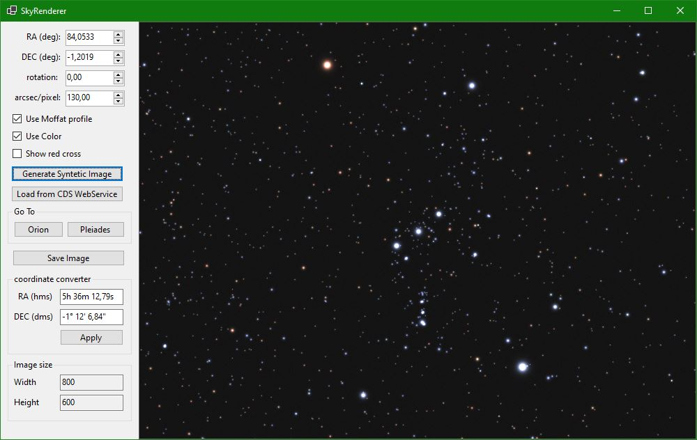

# SkyRenderer

SkyRenderer is a .NET library for generating synthetic astronomical images based on the Tycho-2 star catalog.  
It creates realistic star field images from a star database, offering a variety of configurable parameters.

The library also includes a class to retrieve real sky background images (via the CDS Hips2Fits service), primarily to support validation of the renderer's results.

The included `SkyRendererTest` application is a WinForms-based tool designed to test the library and demonstrate its usage and capabilities.



**Note:** The rendered images contain stars only; galaxies and nebulae are not included.

---

## Features

- Generate synthetic star field images with accurate star positions from the Tycho-2 catalog.
- Support for real sky background images from DSS2 via the CDS Hips2Fits service.
- Configurable image parameters:
  - Field of view and image scale
  - Image dimensions
  - Field rotation
  - Star rendering options (simple or Moffat profile)
  - Star coloring based on B-V index
- High-performance data filtering for large catalogs.
- Supports both synthetic and real background images.
- Image rendering times range from 100 ms to several seconds, depending on FOV, image size, and hardware.
- Low memory footprint.
- Rendered images are compatible with plate-solving tools (verified with Astrometry.net and ASTAP).

---

## Installation

The library requires **.NET 8.0** or later.

### Dependencies

- `Parquet.Net` (5.0.2)
- `SixLabors.ImageSharp` (3.1.5)
- `SixLabors.ImageSharp.Drawing` (2.1.4)

---

## Usage

### Creating a Synthetic Star Field

```csharp
// Initialize the image service
var imageService = new ImageServiceTycho
{
    Width = 800,
    Height = 600,
    RightAscension = 56.600,  // degrees
    Declination = 24.100,     // degrees
    ImageScale = 10.00,       // arcseconds per pixel
    RotationAngle = 0.0,      // degrees
    // Optional parameters:
    UseMoffatProfile = true,  // use realistic star profiles (default: true)
    UseColor = true           // color stars based on B-V index (default: true)
};

// Generate the image
using var image = await imageService.GetImageAsync();
```

### Using Real Sky Background

```csharp
// Initialize the Hips2Fits service
var imageService = new ImageServiceH2F
{
    Width = 800,
    Height = 600,
    RightAscension = 56.6,
    Declination = 24.1,
    ImageScale = 10,
    RotationAngle = 0
};

// Get the image
using var image = await imageService.GetImageAsync();
```

---

## Star Data

The library includes a star catalog in Parquet format derived from the Tycho-2 catalog (I/259).  
It is a merged dataset combining the Tycho-2 catalog with its two supplements and contains star positions and magnitudes in the B and V channels.

The original data source is available at: [https://cdsarc.cds.unistra.fr/viz-bin/cat/I/259](https://cdsarc.cds.unistra.fr/viz-bin/cat/I/259)

---

## Performance Considerations

- Efficient data filtering minimizes memory usage.
- The Parquet format ensures fast data access and filtering.
- Simple image caching is available via the `CachedImage` wrapper (primarily for the Hips2Fits renderer).
- Star rendering performance can be optimized by choosing between simple and Moffat profiles.

---

## Contributing

Contributions are welcome! Feel free to submit pull requests, report bugs, or suggest new features.

---

## License

This project is licensed under the MIT License. See the `LICENSE` file for details.

---

## Acknowledgments

- **CDS (Centre de Données astronomiques de Strasbourg)** for the Hips2Fits service.
- **ESA** for the Tycho-2 star catalog.

---

## Note

This library is designed for astronomical applications, and the generated images are suitable for:

- Simulating astronomical cameras
- Testing plate-solving algorithms
- Educational purposes
- Visualizing star fields

The algorithms and parameters for rendering star sizes and colors have been tuned empirically. For scientific applications, further refinement may be required.
